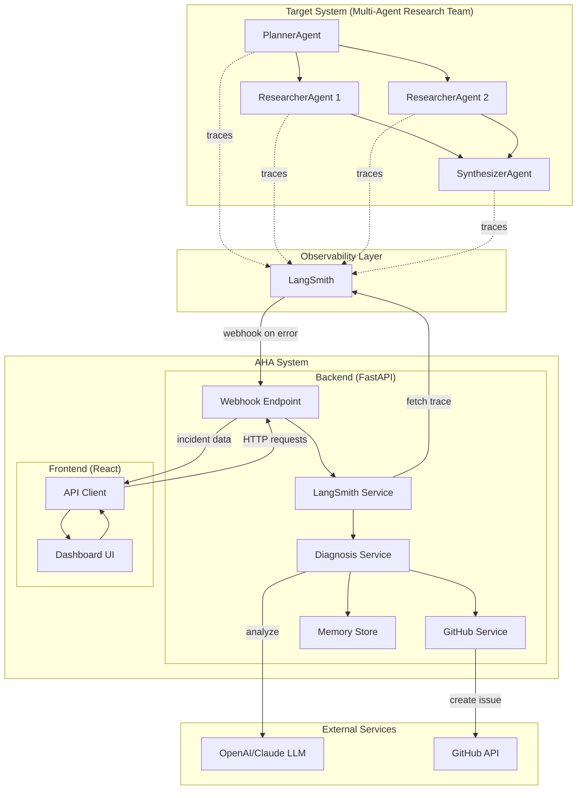
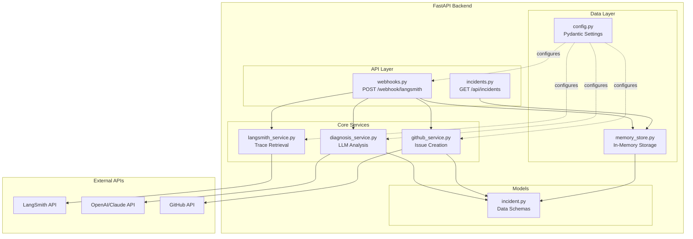
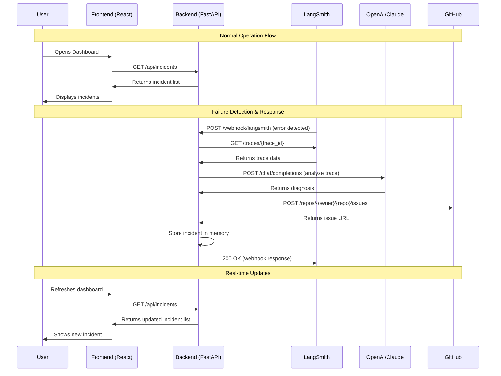
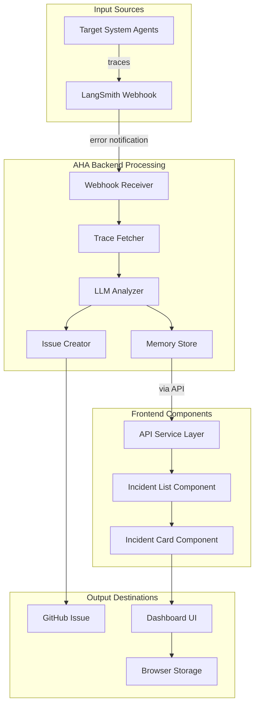
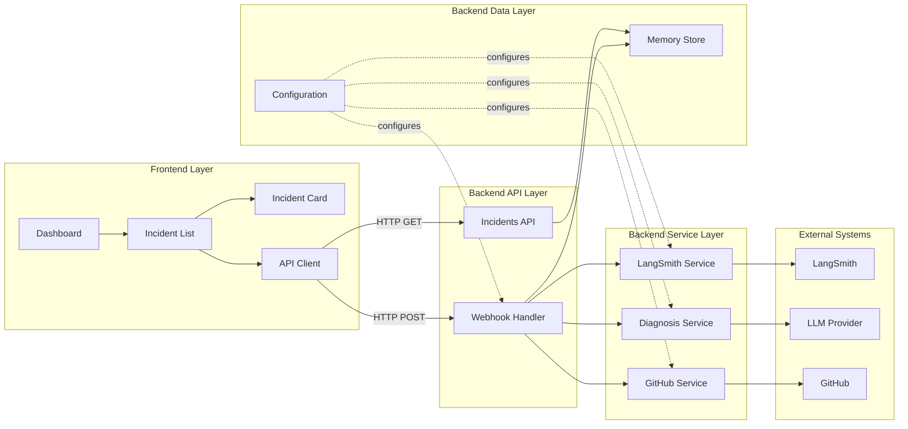
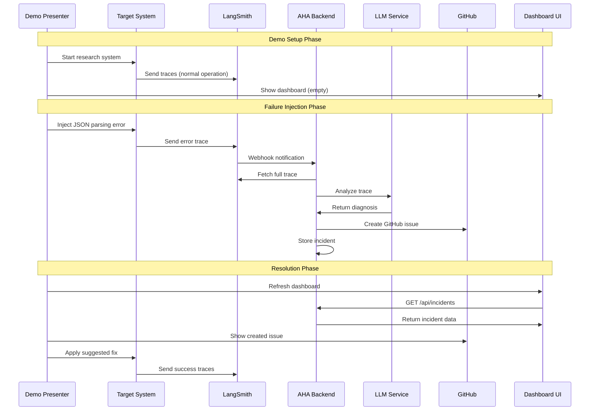
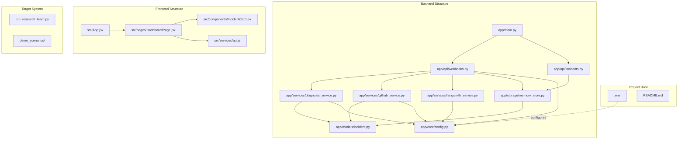

# AHA System Architecture Diagrams

## 1. High-Level System Overview

## 2. Detailed Backend Architecture

## 3. Frontend/Backend Interface Details

## 4. Data Flow Architecture

## 5. Component Interaction Map

## 6. Demo Flow Architecture

## 7. File Structure & Dependencies

## Key Interface Points

### Frontend ↔ Backend Interfaces:
1. **GET /api/incidents** - Frontend fetches incident list
2. **POST /webhook/langsmith** - LangSmith sends error notifications
3. **HTTP REST API** - Standard JSON over HTTP

### Backend ↔ External Services:
1. **LangSmith API** - Fetch trace data
2. **OpenAI/Claude API** - LLM analysis
3. **GitHub API** - Create issues

### Data Storage:
1. **In-Memory Store** - Fast demo storage
2. **Browser localStorage** - Frontend persistence fallback
